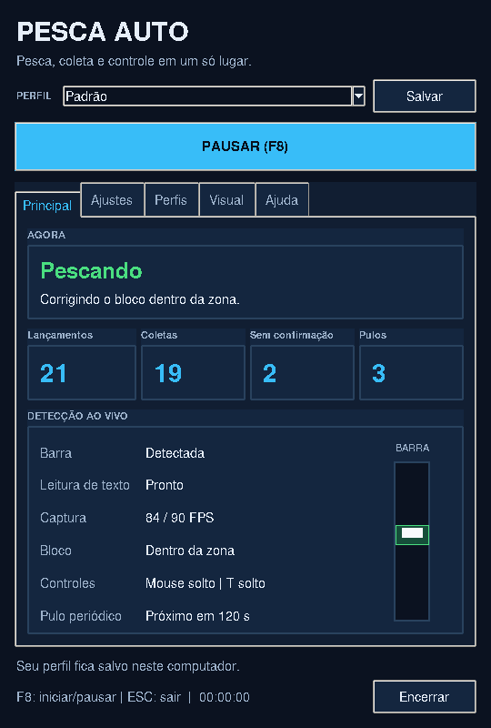

# Mukz auto fish (Windows)

## Modo automatico (experimental)

Use **Python 3.12 de 64 bits**. No terminal aberto nesta pasta, prepare o ambiente uma vez:

```bat
py -3.12 -m venv .venv-auto
.venv-auto\Scripts\python.exe -m pip install -r requirements-auto.txt
```

Se voce ja tem `.venv-auto`, basta atualizar os arquivos do programa e instalar as dependencias com o segundo comando. Nao apague seu ambiente existente.

### Inicio rapido e executavel

O programa abre um hub com abas **Principal**, **Ajustes**, **Perfis**, **Visual** e **Ajuda**. O botao grande inicia/pausa; os atalhos podem ser alterados no perfil (padrao F8 para iniciar/pausar e Esc para encerrar). Principal mostra o estado, contadores, deteccao, FPS medido e uma previa da barra baseada nas posicoes detectadas. Iniciar tenta focar o Roblox e posiciona o ponteiro numa area do jogo para nao clicar no proprio painel. Coloque o hub fora da barra e do aviso Collect. O proprio hub e mascarado na captura analisada para nao confundir a previa e os textos com o jogo. Perda de foco continua pausando. O contador de coletas registra o desaparecimento do aviso apos T, nao confirma inventario ou identifica o item.

Ao atualizar, copie todos os arquivos Python, incluindo **hub.py**, **cycle.py**, **vision_text.py**, **telemetry.py**, **preferences.py**, **screen_mask.py** e **window_icon.py**, para a mesma pasta de fishing_auto.py. Preserve `.venv-auto`. Para atualizar um EXE ja gerado, feche o app e execute gerar_exe.bat novamente. O novo executavel usa o painel sem janela de console. Se houver **icone.ico** junto do script, o icone sera incluido automaticamente. A interface foi renderizada e testada neste ambiente; integracao de tela, atalhos globais e execucao do EXE precisam de confirmacao no Windows.

### Personalizacao por pessoa

O primeiro inicio de pesca de cada abertura do app envia um toque em **Shift esquerdo**, depois de confirmar o Roblox em foco e soltar mouse/T. A tecla e solta antes do primeiro lancamento. Pausar, retomar, mudar de perfil ou recuperar o foco nao repete esse toque. Na aba Ajustes, a opcao "Tocar Shift esquerdo no primeiro inicio" permite desativar o comportamento; alterar a opcao depois do primeiro inicio so vale para a proxima abertura do app. Comece com Shift Lock desligado: Shift alterna o modo e nao consulta se ele ja estava ativo. O jogo precisa oferecer Shift Lock nas configuracoes. Copie tambem **startup_input.py** ao atualizar e gere novamente o executavel.

Para o icone do arquivo EXE, da janela aberta e da barra de tarefas, coloque um **icone.ico** valido junto de gerar_exe.bat e execute o script novamente. O ICO e embutido no EXE e incluido como recurso para o hub; nao e necessario enviar o arquivo original separado ao amigo. A janela utiliza uma identidade propria na barra de tarefas, sem agrupar como Python. Preserve a pasta inteira `dist\Mukz auto fish`. Se houver um icone.ico ao lado do EXE, ele pode substituir o icone da janela; o icone do arquivo EXE exige nova geracao. Um atalho antigo fixado pode continuar com o icone em cache: desafixe e fixe o executavel atualizado novamente. O carregamento nativo do icone ainda precisa ser confirmado no Windows.

Na aba Ajustes, altere FPS, antecipacao, intervalo de pulo e tempos de espera. Os campos mostram limites e explicacoes. "Alterar" captura um novo atalho; F1 a F12 e Esc sao aceitos, sem permitir o mesmo atalho para iniciar e encerrar. Aplicar e salvar pausa a pesca e persiste todos os ajustes do perfil. "Carregar ajustes padrao" preenche os campos; so altera o perfil quando voce salva.

Na aba Visual, escolha tema claro/escuro, cor de destaque, tamanho de 85 a 135%, janela sempre visivel e inicio automatico. Na aba Perfis, crie uma copia dos ajustes, carregue ou exclua perfis e importe/exporte um JSON para compartilhar. Importar cria um nome novo se ja houver um igual. Cada usuario guarda seus perfis em `%LOCALAPPDATA%\PescaAuto\perfis.json`, fora da pasta do EXE; atualizar ou enviar o programa nao copia seus ajustes pessoais. O ultimo perfil salvo e restaurado ao abrir. Arquivos invalidos sao preservados em backup antes de serem substituidos.

As capturas abaixo mostram a interface renderizada com dados simulados:



A versao atual aceita `--auto-start`: inicia em tres segundos e tenta focar a janela de titulo Roblox. Deixe o jogo aberto, a vara equipada e o ponteiro no local usado para pescar. Perda de foco pausa; F8 retoma e Esc encerra. Execute `iniciar_auto.bat` com dois cliques para usar o ambiente `.venv-auto` existente. O primeiro lancamento nao espera a inicializacao do OCR, que ocorre em paralelo. A coleta continua dependendo do OCR.

Para gerar o executavel **no Windows**, execute `gerar_exe.bat`. Ele instala PyInstaller no ambiente separado e empacota os modelos do OCR e o runtime ONNX. O resultado esperado e `dist\Mukz auto fish\Mukz auto fish.exe`: mantenha toda a pasta Mukz auto fish junto. Use um atalho para abrir com um clique; o executavel inicia automaticamente. Foi escolhido o formato de pasta para evitar a extracao de um executavel unico a cada abertura. O painel mostra estado e erros durante a execucao. A geracao e execucao do EXE ainda precisam de validacao no Windows; nao foram executadas neste ambiente Linux.

O controlador usa por padrao ate 90 capturas por segundo, suavizacao da velocidade baseada no tempo e antecipacao limitada do movimento da zona. A frequencia real depende do PC. Compare no jogo; precisao superior ainda nao foi medida. Se oscilar, teste `--lookahead 0.06`; para restaurar a frequencia anterior, use `--fps 60`. Esses parametros tambem podem ser passados ao executavel.

Para iniciar manualmente, execute `.venv-auto\Scripts\python.exe fishing_auto.py`.
Nao precisa selecionar a barra. Deixe o Roblox em foco com a vara equipada e o ponteiro onde o jogo recebe o clique; F8 inicia/pausa e Esc encerra. O programa captura a area da janela em foco cujo titulo contem Roblox, procura a barra de borda branca com bloco branco e zona verde/amarela e controla o clique. Reconhece a palavra inglesa Collect por OCR para segurar T; solta quando o aviso desaparece. O nome e a aparencia do peixe nao sao usados.

A busca da barra e a coleta ainda precisam de validacao no Windows/Roblox. O primeiro minigame pode ser perdido enquanto a barra e localizada. Mantenha a interface em ingles. Perda de foco pausa e solta os controles. Nao ha garantia de reconhecimento em outras cores, escalas ou layouts. Nao requer Tesseract separado.

### Coleta, pulo periodico e diagnostico

Depois que a barra some, o programa espera ate 12 segundos pelo aviso de coleta antes de preparar outro lancamento. O OCR procura primeiro na area central e, se necessario, amplia a busca; reconhece pequenas variacoes de leitura de Collect. Ao coletar, mantem T pressionado durante falhas curtas do OCR. So registra uma coleta depois de pelo menos tres leituras distintas sem o aviso, cobrindo 1,5 segundo. Isso confirma o desaparecimento do aviso, nao a entrada do item no inventario. Coleta que exceda 45 segundos ou OCR desatualizado por muito tempo pausa com motivo no hub.

O pulo periodico usa Espaco e vem ativado com intervalo de **120 segundos**. Altere o campo "Pular a cada (s)" na aba Ajustes e use Aplicar e salvar, ou use `--jump-interval 180` no terminal. `0` desativa. O pulo e adiado ate o intervalo entre pescas, sem barra ou coleta em andamento; nao envia teclas com o app pausado ou sem foco no Roblox. Isso tenta manter atividade, mas nao garante que o servidor deixara de desconectar por inatividade e nao impede desconexoes de rede. Nao faz reconexao automatica. Um aviso de desconexao reconhecido pelo OCR pausa a automacao; reconecte e use Iniciar.

Se nao aparecer minigame por 45 segundos depois do lancamento, uma leitura recente sem Collect permite uma nova tentativa apos uma pequena espera. Pescas sem aviso de coleta e tentativas sem barra entram no contador **Sem confirmacao**, separado de coletas detectadas. Esse contador nao prova que um item foi perdido.

O registro de estados, tentativas, pulos e erros fica em `%LOCALAPPDATA%\PescaAuto\pesca.log`, com rotacao para limitar o tamanho. Nao grava capturas de tela nem o texto completo reconhecido. Para analisar uma falha, anote o horario e consulte esse arquivo. As mudancas foram testadas em cenarios simulados; comportamento prolongado, pulos e coleta precisam ser confirmados no jogo.

Os testes de temporizacao e reconhecimento de texto podem ser executados sem o jogo:

```bat
.venv-auto\Scripts\python.exe -m unittest discover -s tests -v
```

## Modo com selecao manual

No PowerShell, nesta pasta:

```powershell
py -m venv .venv
.\.venv\Scripts\python.exe -m pip install -r requirements.txt
.\.venv\Scripts\python.exe fishing.py --observe
```

Deixe o minigame visível antes de iniciar. Na captura de tela, selecione **somente a barra inteira**, incluindo as bordas, e pressione Enter. Uma janela mostrará as detecções: branco para o bloco e magenta para a zona. Primeiro confira se ambas acompanham os objetos corretamente.

Para controlar o mouse, encerre a observação e execute:

```powershell
.\.venv\Scripts\python.exe fishing.py
```

Depois da seleção, volte ao Roblox e coloque o ponteiro no local onde o jogo recebe o clique. **F8** alterna entre iniciar e pausar; **Esc** encerra. Inicie somente com o jogo em foco. Ao pausar, perder a detecção ou encerrar, o programa solta o botão. O programa não muda o foco nem move o ponteiro.

Segurar faz o bloco subir; soltar faz descer. O controlador estima a velocidade para antecipar a frenagem. Se oscilar demais, experimente `--lookahead 0.04`; se reagir tarde, `--lookahead 0.12`. Padrão: 0.08 segundos. `--fps 60` limita a frequência de captura. Não altere resolução ou posição da janela durante uma sessão.

Esta versão usa as cores das imagens fornecidas: bloco branco e zona verde/amarela. Ela precisa ser calibrada e validada no seu PC; não foi testada no Roblox neste ambiente. Use onde a automação é permitida, sem tentar contornar bloqueios do jogo.

Para lançar a vara com um clique rápido e repetir entre pescas, execute `fishing.py --auto-cast`. Selecione a região com a barra visível, depois pause e volte ao jogo. F8 ativa o controle: se o minigame já estiver visível, controla o bloco; caso contrário, lança uma vez e aguarda. Após dois segundos sem detectar o minigame, aguarda mais três segundos e lança novamente. Se a vara não lançar ou houver uma tela de resultado impedindo a próxima pesca, pause com F8 e resolva manualmente. Não há repetição de cliques enquanto espera uma fisgada. Perdas prolongadas de detecção podem ser confundidas com o fim da pesca.

O titulo da janela e o executavel usam o nome **Mukz auto fish**. O painel exibe apenas **by mukz** abaixo do botao Iniciar/Pausar, sem titulo ou descricao adicionais no cabecalho. Os perfis e registros continuam na pasta de usuario documentada acima para preservar os ajustes de instalacoes anteriores.
